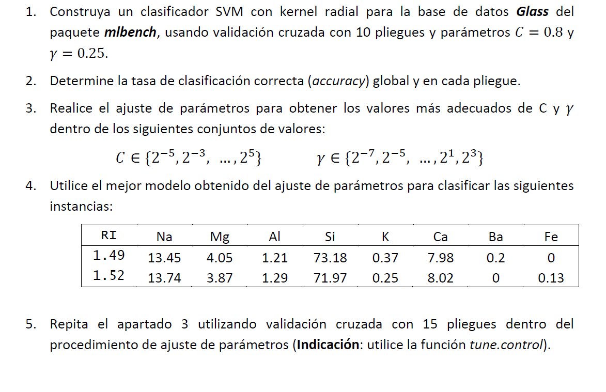
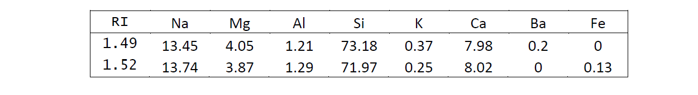

# EJERCICIO 2




**Carga de las librerías necesarias**

```{r message=FALSE, warning=FALSE}
if (!require('mlbench')) install.packages('mlbench'); library('mlbench')
if (!require('e1071')) install.packages('e1071'); library('e1071')
if (!require('caret')) install.packages('caret'); library('caret')
```

**Establecimiento de la semilla**
```{r}
set.seed(123456789)
```

**Carga, inspección y preparación de los datos**

El conjunto de datos *Glass* consta de 214 observaciones y 10 variables:

* [,1]	   **RI**:	 refractive index
* [,2]	   **Na**:	 Sodium
* [,3]	   **Mg**:	 Magnesium
* [,4]	   **Al**:	 Aluminum
* [,5]	   **Si**:	 Silicon
* [,6]	    **K**:	 Potassium
* [,7]	   **Ca**:	 Calcium
* [,8]	   **Ba**:	 Barium
* [,9]	   **Fe**:	 Iron
* [,10]	 **Type**:	 Type of glass (class attribute)

```{r}
data(Glass)
dim(Glass)
summary(Glass)
str(Glass)
head(Glass)
```

```{r}
table(is.na(Glass))
```
La variable objetivo es *Type* y consta de 6 clases (1, 2, 3, 5, 6 y 7). Todos los datos están completos, no hay valores perdidos.

# 1) 

**Construya un clasificador SVM con kernel radial para la base de datos *Glass* del paquete *mlbench*, usando validación cruzada con 10 pliegues y parámetros *C=0.8* y *gamma=0.25***

```{r}
(model_1=svm(Type ~ .,          # Fórmula
             data=Glass,        # Dataframe de datos
             kernel="radial",   # Kernel radial
             scale=TRUE,        # Tipifica variables
             gamma=0.25,        # Gamma
             cost=0.8,          # Parámetro de regularización C
             cross=10))         # Validación cruzada con 10 folds
```

# 2)

**Determine la tasa de clasificación correcta (accuracy) global y en cada pliegue**

```{r}
cat("Accuracy global (modelo 1): ", round(model_1$tot.accuracy, 3), "\n")
cat("Accuracy para cada pliegue: \n", round(model_1$accuracies, 3) )
```

# 3)

**Realice el ajuste de parámetros para obtener los valores más adecuados de *C* y *gamma* dentro de los siguientes conjuntos de valores:**


Ajuste de los parámetros del kernel (*gamma*) y de regularización (*C*) con la función *tune.svm*

```{r}
t1=tune.svm(Type ~ ., 
            data=Glass, 
            gamma=2^seq(from=-7,to=3, by=2), 
            cost=2^seq(from=-5,to=5,by=2))

summary(t1)
```

Visualización del resultado del ajuste de parámetros
```{r}
plot(t1)
```

Modelo con los parámetros ajustados
```{r}
(model_2=t1$best.model)
```

Medida de rendimiento
```{r}
cat("Tasa de clasificación incorrecta (modelo 2): ", round(t1$best.performance, 3), "\n")
cat("Accuracy global (modelo 2): ", round(100*(1-t1$best.performance), 3), "\n")
```

Para el modelo 1 obtuvimos un accuracy de 70.093, mayor que el obtenido con el modelo 2, por tanto el nuevo modelo ajustando parámetros *C* y *gamma* es peor que el construido en el primer apartado.

# 4)

**Utilice el mejor modelo obtenido del ajuste de parámetros para clasificar las siguientes instancias:**



Creación de las instancias
```{r}
instancia_1 = data.frame(RI=1.49, Na=13.45, Mg=4.05, Al=1.21, Si=73.18,
                         K=0.37, Ca=7.98, Ba=0.2, Fe=0)


instancia_2 = data.frame(RI=1.52, Na=13.74, Mg=3.87, Al=1.29, Si=71.97, 
                         K=0.25, Ca=8.02, Ba=0,   Fe=0.13)
```

Predicción de la instancia 1
```{r}
predict(model_1, instancia_1)
```

Predicción de la instancia 2
```{r}
(predict(model_1, instancia_2))
```
Ambas instancias son clasificadas como pertenecientes a la clase "2" segun el modelo con parámetros ajustados *modelo_2*.

# 5) 

**Repita el apartado 3 utilizando validación cruzada con 15 pliegues dentro del procedimiento de ajuste de parámetros (Indicación: utilice la función tune.control)**

```{r}
#?tune.control
#?tune.svm

tc=tune.control(sampling="cross",  # validacion cruzada
                cross=15,          # 15 pliegues
                nrepeat=1, 
                best.model=TRUE)

t2=tune.svm(Type ~ ., 
            data=Glass, 
            tunecontrol=tc,
            gamma=2^seq(from=-7,to=3, by=2),
            cost=2^seq(from=-5,to=5,by=2))

summary(t2)
```

```{r}
model_3=t2$best.model
```

```{r}
cat("Tasa de clasificación incorrecta (modelo 3): ", round(t2$best.performance, 3), "\n")
cat("Accuracy global (modelo 3): ", round(100*(1-t2$best.performance), 3), "\n")
```

# Comparativa

A continuación construiremos una tabla comparativa con el accuracy de los tres modelos obtenidos.

```{r results='asis'}
table_model1=c(model_1$tot.accuracy, 0.01*(100-model_1$tot.accuracy))
table_model2=c(100*(1-t1$best.performance), t1$best.performance)
table_model3=c(100*(1-t2$best.performance), t2$best.performance)

tabla_resumen = data.frame (round(rbind(table_model1, table_model2, table_model3), 3), 
                            row.names=c("modelo 1 (folds=10, C=0.8, gamma=0.25)", 
                                        "modelo 2 (folds=10, C=8  , gamma=0.5)",
                                        "modelo 3 (folds=15, C=32 , gamma=0.125)"))

print(knitr::kable(tabla_resumen, format = "pandoc",
                   col.names = c("Accuracy", "Tasa clasificación incorrecta"), 
                   align='c'))
```

El mejor modelo, que presenta mayor accuracy y por tanto menor tasa de clasificación incorrecta, es el último modelo construido con parámetros ajustados usando validación cruzada con 15 pliegues *modelo_3*.