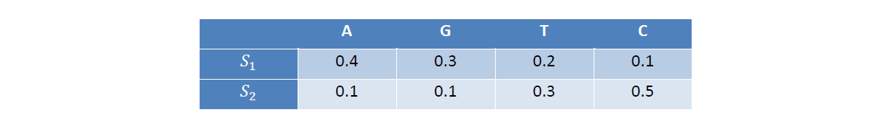

**Como sabemos, en la composición del ADN intervienen 4 bases nitrogenadas: adenina (A), guanina (G), timina (T) y citosina (C). Supongamos que la generación de estas bases está regulada por una variable no observable *S*, con dos posibles estados *S1* y *S2*. En la generación consecutiva de dos bases, la variable *S* permanece en el mismo estado en el 80% de los casos (ambos estados son igualmente probables inicialmente). Por otra parte, las probabilidades de generar las distintas bases en función del estado de la variable *S* aparecen recogidas en la siguiente tabla:**



**Carga de librerías**
```{r message=FALSE, warning=FALSE}
if (!require('HMM')) install.packages('HMM'); library('HMM')
```

**Establecimiento de la semilla**
```{r}
set.seed(123456789)
```


# Apartado 1 

**Construya el modelo *HMM* correspondiente usando la librería *HMM***

## 1.1 Definición de parámetros
```{r}
# Vector con los nombres de los estados ocultos
Estados = c("S1", "S2")

# Vector con los nombres de los símbolos observados
Observado = c("A", "G", "T", "C")

# Vector con las probabilidades iniciales de los estados
ProbIni = c(0.5, 0.5)

# Matriz con las probabilidades de transición entre estados
ProbTrans = matrix(c(0.8, 0.2, 0.2, 0.8),nrow=2,byrow=T)

# Matriz con las probabilidades de emisión de los estados
ProbEmis = matrix(c(0.4, 0.3, 0.2, 0.1, 0.1, 0.1, 0.3, 0.5),nrow=2,byrow=T)
```

## 1.2 Construcción del modelo
```{r}
modHMM = initHMM(Estados, Observado, ProbIni, ProbTrans, ProbEmis)
```

```{r}
print(modHMM)
```

# Apartado 2 

**Calcule la probabilidad de obtener la siguiente secuencia: *CGTCAGATA***

## 2.1 Secuencia observada
```{r}
SecObs = c("C", "G", "T", "C", "A", "G", "A", "T", "A")
```

## 2.2 Cálculo de las probabilidades forward
```{r}
(Pforward = exp(forward(modHMM, SecObs)))
```

## 2.3 Cálculo de las probabilidades backward
```{r}
(Pbackward = exp(backward(modHMM, SecObs)))
```

## 2.4 Probabilidad de obtener la secuencia observada
```{r}
for (t in 1:9)
  print(sum(Pforward[,t] * Pbackward[,t]))
```


# Apartado 3 

**Dado que se ha observado la secuencia anterior, calcule la probabilidad de que la variable *S* se haya encontrado en cada uno de los dos estados posibles a lo largo de la generación de la secuencia (probabilidades a posteriori)**

## 3.1 Cálculo de las probabilidades a posteriori
```{r}
(Pposterior = posterior(modHMM, SecObs))
```

## 3.2 Probabilidad a posteriori para cada estado

A continuación calcularemos la probabilidad de cada estado de la variable *S* condicionado a la secuencia observada *CGTCAGATA*
```{r}
cat("P(Y9=S1 | X=CGTCAGATA): ",round(Pposterior["S1",9], 3), "\n")
cat("P(Y9=S2 | X=CGTCAGATA): ",round(Pposterior["S2",9], 3), "\n")
```


# Apartado 4 

**A partir de la secuencia observada, determine la secuencia de estados más probable para la variable *S***
```{r}
(Estados = viterbi(modHMM, SecObs))
```

# Apartado 5

**Genere una secuencia de longitud 100 mediante simulación**
```{r}
(sim = simHMM(modHMM, 100))
```
